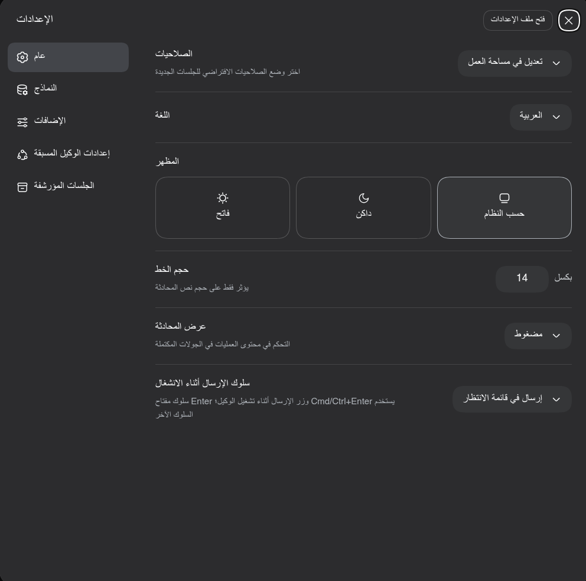

# DeepSeek Harness — النسخة العربية (DSH-Arabic)
[English](README.md) | [中文](README.zh.md) | **العربية**

[](LICENSE)
[](https://nodejs.org)
[](https://www.docker.com)
[](https://github.com/deepseek-ai/deepseek-harness)

> **⚠️ نسخة fork غير رسمية (unofficial)** من [DeepSeek Harness](https://github.com/deepseek-ai/deepseek-harness).
> هذا المستودع لا ينشره DeepSeek AI ولا يديره. الترخيص الأصلي MIT محفوظ كما هو.



## نظرة عامة

DeepSeek Harness (`dsh`) هو بنية تشغيل مفتوحة المصدر لوكلاء الذكاء الاصطناعي
("Everything is a Plugin") طوّرها DeepSeek AI. هذه النسخة تضيف فوق الأصل:

| العنصر | الأصل | هذه النسخة |
|--------|-------|-----------|
| التعريب | en + zh | **ar** — حزمة 45 وحدة (43 namespace) |
| Docker | غير متوفر | `Dockerfile` متعدد المراحل + `docker-compose.yml` |
| التوثيق العربي | — | `README.ar.md` + `docs/ar-*.md` |
| التهيئة الأولية | من الصفر | Ollama + 3 نماذج جاهزة + اللغة العربية |

## المتطلبات

| المكوّن | المتطلب | ملاحظة |
|---------|---------|--------|
| Docker + Compose | موجودان على الجهاز | قيمة عملية لا موثقة رسميًا في الأصل |
| Node.js | `^22.19 ‖ >=24` | **داخل الحاوية فقط** (الصورة `node:24`) — المضيف لا يحتاجه |
| ذاكرة | غير موثَّقة | — |
| نظام التشغيل | مُختبَر على Linux فقط | macOS/Windows غير مُختبر |
| Ollama (اختياري) | على المضيف | إن أردت تشغيل النماذج محليًا |

## التثبيت السريع

```bash
git clone --branch ar-docs-v1.0.0 --depth 1 https://github.com/naifmalharthi/deepseek-harness
cd deepseek-harness
docker compose up -d --build
docker logs dsh-web 2>&1 | grep -oE 'token=[A-Za-z0-9_-]+' | head -1
```

ثم افتح في المتصفح:

```
http://127.0.0.1:3080/?token=<token>
```

> **لماذا `127.0.0.1`؟** الواجهة تقيّد الإعدادات على عنوان loopback فقط —
> هذا سلوك مُصمَّم في الأصل. التفاصيل والحلول في
> [docs/ar-TROUBLESHOOTING.md](docs/ar-TROUBLESHOOTING.md).

## الإعداد الأولي

1. **التوكن**: يُطبع عند أول تشغيل في السجل (`docker logs dsh-web`).
2. **اللغة**: مفعّلة مسبقًا بالعربية (`locale.preference: ar`) — تُبدَّل أيضًا من تبويب الإعدادات.
3. **النموذج**: `qwen3.8:27b` هو الافتراضي (`agent-default-model`) — تُغيّره من تبويب "النماذج".

## التكوين

كل الإعدادات في `/home/node/.dsh/settings.yaml` داخل الـ volume `dsh_home`.
مثال حقيقي من هذين الإعداد:

```yaml
llm-pi-ai:
  providers:
    ollama:
      displayName: ollama
      api: openai-completions
      baseURL: http://host.docker.internal:11434/v1
      apiKeyEnv: OLLAMA_API_KEY
      models:
        - id: qwen3.8:27b
          name: qwen3.8:27b
        - id: edtorre/qwen3.6-hermes:latest
          name: Qwen3.6 Hermes
        - id: qwen3.6:35b
          name: qwen3.6:35b
agent-default-model:
  provider: ollama
  model: qwen3.8:27b
locale:
  preference: ar
```

شرح كامل لكل المفاتيح: [docs/ar-CONFIGURATION.md](docs/ar-CONFIGURATION.md)

## الاستخدام اليومي

| العملية | الأمر |
|---------|-------|
| الواجهة | `http://127.0.0.1:3080/?token=<token>` |
| السجلات | `docker logs dsh-web -f` |
| إعادة التشغيل | `docker compose restart` |
| الإيقاف (مع حفظ البيانات) | `docker compose down` |
| البناء من جديد | `docker compose up -d --build` |

## حل المشاكل

الأكثر شيوعًا (رسالة "settings are unavailable"، تعارض الشبكات، زر "فتح ملف الإعدادات"):
→ [docs/ar-TROUBLESHOOTING.md](docs/ar-TROUBLESHOOTING.md)

## البنية

```
dsh-web (حاوية واحدة)
├── port:      3080 ← 3080
├── volume:    dsh_home → /home/node/.dsh   (الإعدادات، الجلسات، التخزين)
├── network:   deepseek-harness_default
│             subnet 10.42.0.0/24، بوابة 10.42.0.1، IP الحاوية 10.42.0.2
├── env:       DSH_HOME، OLLAMA_API_KEY
└── healthcheck: طلب HEAD عبر node (رد 401 = حيّ)
```

لماذا هذه الشبكة؟ [docs/ar-TROUBLESHOOTING.md — اختيار subnet](docs/ar-TROUBLESHOOTING.md)

## المساهمة

المشروع الأصل **لا يقبل pull requests حاليًا** (نص [CONTRIBUTING.md](CONTRIBUTING.md)
الأصلي: "we cannot accept external pull requests at the moment").

طرق المساهمة الواقعية:
1. **الإبلاغ عن المشكلات/النقاش**: [GitHub Discussions](https://github.com/deepseek-ai/deepseek-harness/discussions)
2. **بناء plugin خاص** مع وسم [`dsh-plugin`](https://github.com/topics/dsh-plugin)
3. **المساهمة في هذا fork**: [CONTRIBUTING.ar.md](CONTRIBUTING.ar.md)

## الترخيص

MIT — [LICENSE](LICENSE) (Copyright (c) 2026 DeepSeek — كما هو دون تغيير).
عروض الترخيص الأخرى في [THIRD_PARTY_NOTICES.md](THIRD_PARTY_NOTICES.md).

## شكر ومراجع

- [المشروع الأصلي](https://github.com/deepseek-ai/deepseek-harness)
- [Cordis](https://github.com/cordiverse/cordis) — بنية الوحدات في قلب DSH
- [Ollama](https://ollama.com) — تشغيل النماذج محليًا
- [المجتمع: Discord](https://discord.gg/Ycq5dCaS4)
